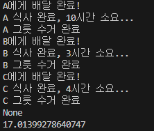
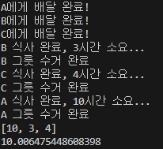

# 파이썬 코루틴과 비동기 함수

## 바운드와 블로킹
### CPU 바운드
- 프로그램이 싱행될 때 실행 속도가 CPU 속도에 의흐ㅐ 제한됨을 의미함.
- 정말 복잡한 수학 수식을 계산하는 경우에 컴퓨터의 실행속도가 느려짐 .
### I/O 바운드
- input/output을 의미
- 프로그램이 실행될 때 실행 속도가 I/O에 의해 제한됨을 의미한다.
- 사용자가 입력을 하는 시간에 따라 프로그램의 실행 속도가 결정됨!
- 컴퓨터와 컴퓨터 끼리도 I/O바운드 발생 
    - 특정 웹에 요청을 하여 응답을 기다리는 코드를 예로
    - 요청을 하는 것이 I
    - 응답을 하는 것이 O가 되는 I/O바운드

### 블로킹 
- 바운드에 의해 코드가 멈추게 되는 현상이 일어나는 것

## 동기(Sync) vs 비동기(Async)
### 동기(Sync)
- 코드가 동기적으로 동작한다 => 코드가 반드시 작성된 순서 그대로 실행된다.  
- 요청을 하면 응답을 받고 다음 요청을 보내는 구조
- 일반적인 파이썬 함수는 동기적임.

예시코드
```python
import time


def delivery(name, mealtime):
    print(f"{name}에게 배달 완료!")
    time.sleep(mealtime)
    print(f"{name} 식사 완료, {mealtime}시간 소요...")
    print(f"{name} 그릇 수거 완료")


def main():
    delivery("A", 10)
    delivery("B", 3)
    delivery("C", 4)


if __name__ == "__main__":
    start = time.time()
    print(main())  # None
    end = time.time()
    print(end - start)

```


=> 17초가 소요됨

### 비동기(Async)
- 코드가 비동기적으로 동작한다 => 코드가 반드시 작성된 순서 그대로 실행되는 것이 아니다. 
- 요청부터 다 보내두고 그 다음 응답을 받는 구조

예시코드
```python
import time
import asyncio


async def delivery(name, mealtime):
    print(f"{name}에게 배달 완료!")
    await asyncio.sleep(mealtime)
    print(f"{name} 식사 완료, {mealtime}시간 소요...")
    print(f"{name} 그릇 수거 완료")
    return mealtime


async def main():

    result = await asyncio.gather(
        delivery("A", 10),
        delivery("B", 3),
        delivery("C", 4),
    )

    print(result)


if __name__ == "__main__":
    start = time.time()
    asyncio.run(main())
    end = time.time()
    print(end - start)

```


=> 10초 소요

#### 무작정 비동기 구조를 만든다고 좋은게 아님
#### 요청을 보내고 응답을 받는 구조에서 비동기 함수가 유용하게 작용함

## 파이썬 코루틴
루틴: 일련의 명령(코드의 흐름)
### 메인 루틴 
- 프로그램의 메인 코드의 흐름
### 서브 루틴 
- 보통의 함수나 메소드 (메인 루틴을 보조하는 역할)
- 하나의 진입점(호출)과 하나의 탈출점(return)이 있는 루틴
### 코루틴
- 서브 루틴의 일반화된 형태
- 다양한 진입점과 다양한 탈출점이 있는 루틴
- 해당 로직들이 진행되는 중간에 멈추어서 특정 위치로 돌아 갔다 다시 코루틴에서 진행되었던 위치로 돌아와 나머지 로직을 수행할 수 있다.
- 파이썬 비동기 함수는 코루틴 함수로 만들 수 있다.
- https://docs.python.org/ko/3/library/asyncio-task.html 참고