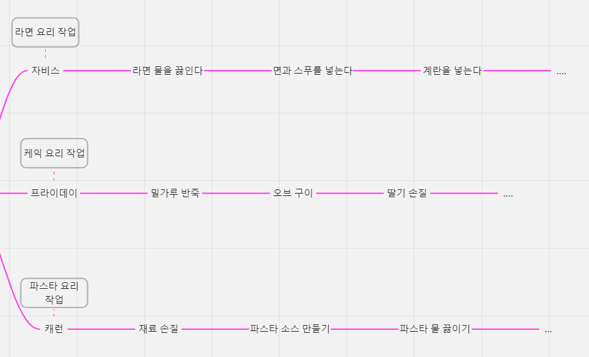

# 파이썬 멀티 스래딩과 멀티 프로세싱
## 컴퓨터 구조와 운영체제 기본
### 컴퓨터 구성 요소
- CPU: 명령어를 해석하여 실행하는 장치
- 메모리: 작업에 필요한 프로그램과 데이터를 저장하는 장소
- 입출력장치: 키보드 마우스 등
- 시스템 버스: 각각의 구성요소들을 연결 해주는 역할
### 운영체제(OS)
- 정의: 컴퓨터 시스템을 운영하고 관리하는 소프트웨어
- 운영체제가 없는 컴퓨터는 처음에 설계한 대로만 사용할 수 있는 단순 계산기에 불과함
- 운영체제가 있는 컴퓨터를 프로그램이 가능한 기계라고 함.
- WindowOS, MacOS, Ubuntu

### 프로세스 - 싱행을 위해 주메모리에 올라온 동적인 상태
- 프로그램: 어쩐 문제를 해결하기 위해 컴퓨터에게 주어지는 처리 방법과 순서를 기술한 일련의 명령문의 집합체
- 프로그램이 실행된다? -> 프로그램의 작성된 코드들이 주메모리로 올라와 작업이 진행됨 -> 프로세스가 생성되면 CPU는 프로세스가 해야할 작업을 수행한다.

### 스레드 - CPU가 처리하는 작업의 단위
- 싱글 스레드, 멀티 스레딩이 존재
- 멀티 스레딩에서 스레드는 다수의 스레드끼리 메모리 공유와 통신이 가능
    - 자원의 낭비를 막고 효율성 향상
    - 한 스레드에 문제가 생기면 전체 프로세스에 영향을 미친다.
- 사용자 수준 스레드와 커널 수준 스레드 두 종류가 존재

## 동시성(병행성) VS 병렬성
### 동시성(concurrency)
동시성이란 한 번에 여러 작업을 동시에 다루는 것을 의미   
-> 한번의 여러 작업을 스위칭을 하며 진행하는 형식


동시성은 논리적 개념으로 멀티 스레딩에서 사용되기도 하고 싱글 스레드에서 사용되기도 한다.   
또한 싱글 코어 뿐만 아니라 멀티 코어에서도 각각의 코어가 동시성을 사용할 수 있음.

### 병렬성(Parallelism)
병렬성은 한 번에 여러 작업을 병렬적으로 처리하는 것을 의미   
-> 혼자가 아닌 작업을 수행하는 무언가 더 추가되어 다 같이 동시에 일을 진행하는 형식


병렬성은 물리적 개념으로 예시에서 여러 로봇들이 여러 작업을 병렬로 수행한 것처럼, 멀티 코어에서 여러 작업을 병렬적으로 수행함.

- 멀티 스레딩과 멀티 프로세싱은 병렬성이라고 보면 됨!!
- 근데 파이썬에서는 멀티 스레드가 병렬적으로 동작 할 수 없대 왜??

멀티 스레딩 예제 코드
```python
# https://docs.python.org/3.7/library/concurrent.futures.html#concurrent.futures.ThreadPoolExecutor
import requests
import time
import os
import threading
from concurrent.futures import ThreadPoolExecutor


def fetcher(params):
    session = params[0]
    url = params[1]
    print(f"{os.getpid()} process | {threading.get_ident()} url : {url}")
    with session.get(url) as response:
        return response.text


def main():
    urls = ["https://google.com", "https://apple.com"] * 50

    executor = ThreadPoolExecutor(max_workers=10)

    with requests.Session() as session:
        # result = [fetcher(session, url) for url in urls]
        # print(result)
        params = [(session, url) for url in urls]
        results = list(executor.map(fetcher, params))
        print(results)


if __name__ == "__main__":
    start = time.time()
    main()
    end = time.time()
    print(end - start)  # 6.8

```

- 멀티 스레딩을 하는 것보다 코루틴 함수를 활용하는 것이 더 좋음
- 스레딩을 만들고 하는 것들도 다 연산이기 때문에!!

## GIL (Global Interpreter Lock)
멀티 스레딩의 치명적 단점은 메모리 공유한다는 것에서 발생   
-> 하나의 자원을 동시에 여러 스레드가 가져가려는 상황이 발생하면 충돌!   
-> 스레드가 다른 스레드에 의해 차단될 수 있음.

### GIL은 이러한 문제를 해결함
- 한 번에 1개의 스레드만 유지하는 락
- 한 스레드가 다른 스레드를 차단해서 제어를 얻는 것을 막아줌
- 이 때문에 파이썬에서는 스레드로 병렬성 연산을 수행하지 못하는 것!

파이썬 멀티 스레딩은 동시성을 사용하여 I/O bound 코드에서 유용하게 사용할 수 있지만 cpu bound 코드에서는 GIL에 의해 원하는 결과를 얻을 수 없음.

=> 멀티 프로세싱은 이러한 것을 막아줌!