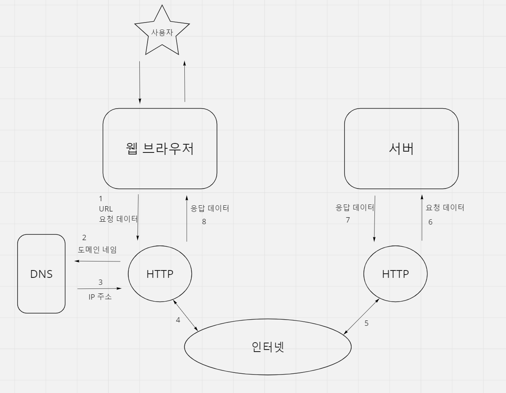
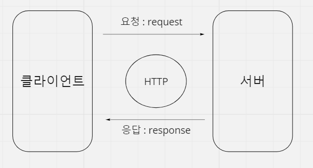

# 동시성 프로그래밍으로 데이터 수집
## 서버와 클라이언트, HTTP, API 이해
- 
    -  
    - 

## 웹 크롤링, 스크래핑 법적 주의사항
웹 크롤링 - 검색 엔진의 구축 등을 위하여 특정한 방법으로 웹 페이지를 수집하는 프로그램   
웹 스크래핑 - 웹에서 데이터를 수집하는 프로그램

### robot.txt라는 크롤링 규칙 파일을 잘 확인하고 진행하자   
[구글robots.txt](https://google.com/robots.txt)

## 동시성 프로그래밍으로 웹 크롤링, 스크래핑 성능 극대화
여러 페이지에 위치한 데이터를 동시에 수집하기 위해 동시성 프로그래밍 활용

예시코드
```python
from bs4 import BeautifulSoup
import aiohttp
import asyncio

# https://www.crummy.com/software/BeautifulSoup/bs4/doc/
# pip install beautifulsoup4


async def fetch(session, url, i):
    print(i + 1)
    async with session.get(url) as response:
        html = await response.text()
        soup = BeautifulSoup(html, "html.parser")
        cont_thumb = soup.find_all("div", "cont_thumb")
        for cont in cont_thumb:
            title = cont.find("p", "txt_thumb")
            if title is not None:
                print(title.text)


async def main():
    BASE_URL = "https://bjpublic.tistory.com/category/%EC%A0%84%EC%B2%B4%20%EC%B6%9C%EA%B0%84%20%EB%8F%84%EC%84%9C"
    # 스크래핑할 url 세팅
    urls = [f"{BASE_URL}?page={i}" for i in range(1, 10)]
    async with aiohttp.ClientSession() as session:
        await asyncio.gather(*[fetch(session, url, i) for i, url in enumerate(urls)]) #enumerate(): index생성


if __name__ == "__main__":
    asyncio.run(main())

```

