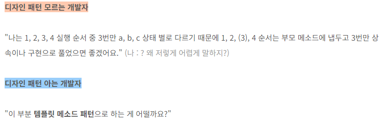

# 디자인 패턴이란?

**디자인 패턴**은 소프트웨어 디자인 과정에서 자주 발생하는 문제들에 대한 전형적인 해결책이다.   
이는 코드에서 반복되는 디자인 문제들을 해결하기 위해 맞춤화할 수 있는 미리 만들어진 `청사진`과 비슷하다.

>청사진(靑寫眞) 또는 블루프린트(영어: blueprint)는 아키텍처 또는 공학 설계를 문서화한 기술 도면을 인화로 복사하거나 복사한 도면을 말한다. 은유적으로 "청사진"이라는 용어는 어떠한 자세한 계획을 일컫는 데에 쓰인다.   -위키백과-

표준화된 라이브러리들이나 함수들을 복사해 사용하는 것처럼 패턴들을 붙여넣기 식으로는 사용할 수는 없다.  왜냐하면 패턴은 재사용할 수 있는 코드 조각이 아니라 특정 문제를 해결하는 방식을 알려주는 일반적인 개념이기 때문이다. 

패턴은 알고리즘과 자주 혼동된다.   
두 개념 모두 알려진 문제에 대한 일반적인 해결책을 설명하기 때문이다. 하지만 차이가 있는데,
 - 알고리즘은 어떤 목표를 달성하기 위해 따라야 할 명확한 일련의 절차를 정의한다. (요리법)
 - 패턴은 해결책에 대한 더 상위 수준의 설명이다. (청사진)
 
 예를 들어 두개의 다른 프로그램에 같은 패턴을 적용하면 두 프로그램의 코드는 다를 것이다. 
 ```
패턴은 결과와 기능들은 제시하나 구현 단계 및 순서는 사용자가 결정한다.
```


# 디자인 패턴을 왜 알아야 할까?
### 1. 소통이 편해진다.

위는 한 블로그가 들어준 예시이다.   
디자인 패턴을 아는 순간 대화가 짧고 명확해진다.
### 2. 더 새련되고 빠른 개발을 할 수  있다.
위에서 보았듯이 디자인 패턴을 알고있다면 서로간의 소통이 명확/간결하게 이루어지고 이는 개발하는데 많은 도움이 된다.

# 디자인 패턴의 종류
디자인의 패턴은 보통 
- 생성(Creational) (5개)
- 구조(Structural) (7개)
- 행동(Behavioral) (11개)

위 3가지로 분류된다.   
(이것의 확장 버전이나 변형버전의 패턴 역시 존재함)

하지만 모든 패턴을 알 필요는 없다.   
왜냐하면 
1. 이미 파이썬에서 보이지 않는 단계에서 구현된 상태이기 때문이다.

2. 모든 패턴이 일반적인 것은 아니기 때문이다.
   * 특별한 경우에만 사용되는 디자인 패턴이 존재.

# 마무리

디자인 패턴이 왜 필요한지 인지하며 공부하도록 하자.

또한 디자인 패턴을 강제로 적용하는 것이 Best가 아니란 점을 알아야 한다.

어떤 개념이건 항상 자신의 어플리케이션에 적용하기 위해서는 해당 패턴이 알맞은지 선행적인 검토가 필요하다.


>참고   
https://refactoring.guru/ko/design-patterns/what-is-pattern
https://effortguy.tistory.com/182   
https://wikidocs.net/168367